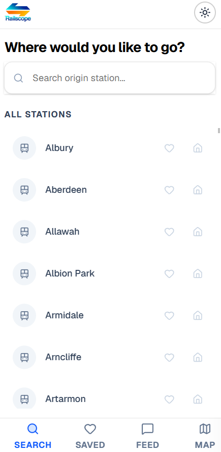
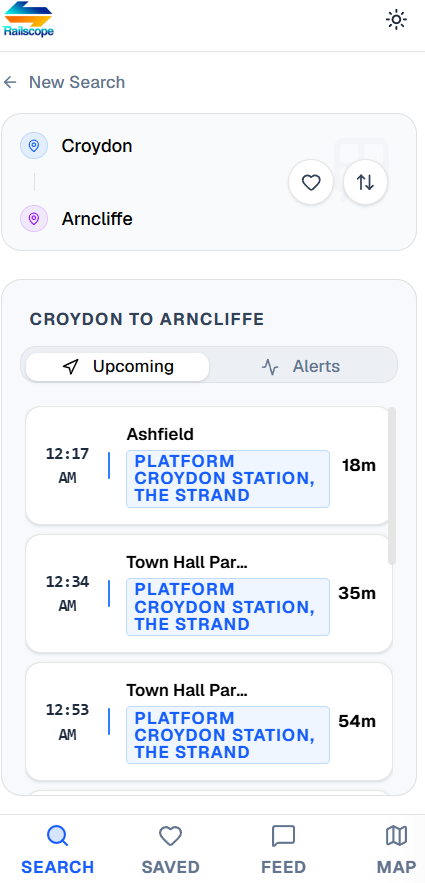
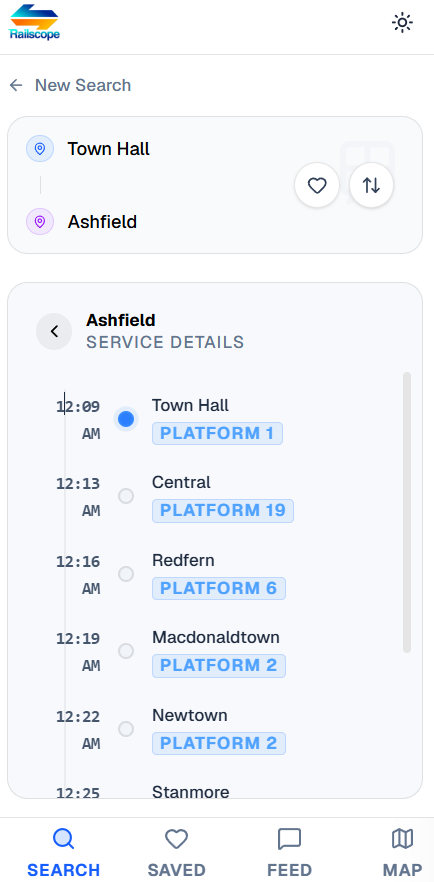

<div align="center">


# RailScope

**A fast, free, open-source, ad-free live transport tracker for Sydney &amp; NSW.**

Real-time train departures, stop-by-stop service tracking, a live vehicle map, and a
community network feed — with zero ads, zero paywalls, and zero subscriptions.

[](https://railscope.pages.dev)
[](LICENSE)
[](https://railscope.pages.dev)
&nbsp;


[**Live App**](https://railscope.pages.dev) &nbsp;·&nbsp;
[**Download**](#-download) &nbsp;·&nbsp;
[**Quick start**](#-quick-start) &nbsp;·&nbsp;
[**Architecture**](ARCHITECTURE.md)

</div>

---

## 📸 Screenshots

<table>
  <tr>
    <td width="33%"></td>
    <td width="33%"></td>
    <td width="33%"></td>
  </tr>
  <tr>
    <td align="center"><b>Instant station search</b><br/><sub>Quick, efficient search across every NSW station</sub></td>
    <td align="center"><b>Live departures</b><br/><sub>Real-time countdowns, platforms &amp; service alerts</sub></td>
    <td align="center"><b>Service details</b><br/><sub>Follow one train through every stop on its run</sub></td>
  </tr>
</table>

---

## 💡 Why RailScope?

Let's be honest: **TripView is trash.** It's bloated with invasive ads, charges money
just to save your daily trips or hide advertising, and feels sluggish on a modern phone.

**RailScope was built out of frustration with that paywalled, ad-ridden status quo.** It's
100% free, fast, responsive, and completely open-source. No subscriptions, no ads, and no
artificial paywalls for saving your favourite stations or routine commutes.

---

## ✨ Features

| | |
|---|---|
| 🔍 **Conversational station search** | Guided *"Where from?"* → *"Where to?"* flow with a quick, efficient local search — no waiting on the network to find your station. |
| 🚆 **Live departures & countdowns** | Real-time departure times, minutes-to-go, platform numbers, and an **Alerts** tab for disruptions on your route. |
| 🧭 **Stop-by-stop service details** | Tap any service to see its full stop sequence with timings and platforms, so you always know how many stops are left. |
| 🗺️ **Live interactive map** | Real-time Sydney Trains &amp; bus positions on a Leaflet map with speed and route badges, polled continuously. |
| ⭐ **Unlimited saved journeys & stations** | Pin your home station, favourite stops, and routine trips with one tap. No paywall, ever. |
| 🗣️ **Network feed** | A community feed for delay reports, tips, and photos — synced live via Firebase Firestore. |
| 📱 **Native app experience** | Installable PWA plus packaged Android and Windows builds. Full safe-area support (notch / Dynamic Island), smooth gestures, and dark mode. |
| 🎙️ **Voice search** | Speak a station name instead of typing it. |

---

## 📦 Download

| Platform | Link |
|---|---|
| 🌐 **Web (any device)** | **[railscope.pages.dev](https://railscope.pages.dev)** — installable as a PWA from your browser menu |
| 🤖 **Android** | [Download `.apk`](https://github.com/Chimthuwu/Railscope/releases) from the releases page |
| 🪟 **Windows** | [Download the installer `.exe`](https://github.com/Chimthuwu/Railscope/releases) from the releases page |

---

## 🛠️ Tech Stack

| Layer | Technology |
|---|---|
| **Frontend** | React 19, TypeScript, Vite 6, Tailwind CSS v4, Lucide icons, Motion |
| **Maps** | Leaflet, React-Leaflet, CartoDB basemap tiles |
| **Backend / proxy** | Node.js + Express (`server.ts`), deployable to Cloudflare Pages Functions or Render |
| **Realtime data** | Transport for NSW (TfNSW) Open Data — GTFS-Realtime &amp; Trip Planner APIs |
| **Community feed** | Firebase Auth (anonymous + Google) &amp; Cloud Firestore |
| **Packaging** | Capacitor (Android), Electron (Windows), PWA manifest |

---

## 🚀 Quick Start

### Prerequisites

- **Node.js 18+**
- A free **TfNSW API key** from the [TfNSW Open Data Hub](https://opendata.transport.nsw.gov.au/)
- A free **CARTO API key** for map tiles from [carto.com/basemaps/apikey](https://carto.com/basemaps/apikey)
- *(optional)* An **AssemblyAI API key** for voice search from [assemblyai.com/dashboard/api-keys](https://www.assemblyai.com/dashboard/api-keys)

### Install &amp; run

```bash
# 1. Clone
git clone https://github.com/Chimthuwu/Railscope.git
cd Railscope

# 2. Install dependencies
npm install

# 3. Add your keys
cp .env.example .env    # then edit .env:
#   TFNSW_API_KEY="..."        (server-side, used by the API proxy)
#   VITE_CARTO_API_KEY="..."   (inlined into the frontend build for map tiles)
#   ASSEMBLYAI_API_KEY="..."   (optional, server-side, powers voice search)

# 4. Start the dev server (Express + Vite on http://localhost:3000)
npm run dev
```

### Handy scripts

| Command | What it does |
|---|---|
| `npm run dev` | Dev server with hot reload (`http://localhost:3000`) |
| `npm run build` | Build the frontend (`dist/`) and bundle the server (`dist/server.cjs`) |
| `npm start` | Run the production server from `dist/` |
| `npm run lint` | Type-check with `tsc --noEmit` |
| `npm run electron:dev` | Run the desktop shell against the dev server |
| `npm run electron:dist` | Build the Windows installer |

---

## ☁️ Deployment

RailScope's frontend is a static SPA; the API layer is a thin proxy that keeps your TfNSW
key server-side. Two supported targets:

### Cloudflare Pages (web app — recommended)

Serverless, no cold starts, free.

| Setting | Value |
|---|---|
| Build command | `npm run build` |
| Build output directory | `dist` |
| Framework preset | None |

Add both keys under **Settings → Environment Variables** (they must be present for the
build, since `VITE_CARTO_API_KEY` is inlined into the bundle):

| Variable | Purpose |
|---|---|
| `TFNSW_API_KEY` | TfNSW API proxy (used by the Pages Functions in [`functions/api/`](functions/api)) |
| `VITE_CARTO_API_KEY` | CARTO basemap map tiles |
| `ASSEMBLYAI_API_KEY` | *(optional)* voice search speech-to-text (`functions/api/transcribe.ts`) |

### Render (self-hosted API / native app backend)

A [`render.yaml`](render.yaml) blueprint is included. If you configure the service
manually, use:

| Setting | Value |
|---|---|
| Build command | `npm install && npm run build` |
| Start command | `npm start` |
| Environment | `TFNSW_API_KEY=<your key>`, `VITE_CARTO_API_KEY=<your key>`, `ASSEMBLYAI_API_KEY=<your key>` (optional) |

> **Note:** don't set `NODE_ENV=production` on Render — it makes `npm install` skip the
> build tools. The server detects Render automatically and serves the built frontend.

Native builds (Android / Electron) call the hosted API directly — set that URL in
[`src/lib/config.ts`](src/lib/config.ts).

---

## 📁 Project Structure

```
Railscope/
├── functions/api/      # Cloudflare Pages Functions (production API proxy)
├── server.ts           # Express API proxy + static server (dev & Render)
├── src/
│   ├── components/
│   │   ├── Map.tsx      # Leaflet live vehicle map
│   │   ├── LiveFeed.tsx # Departures, trip planner & service details
│   │   └── Feed.tsx     # Community feed + hidden admin tools
│   ├── data/stations.ts # Bundled NSW station dataset for instant search
│   ├── lib/             # config, Firebase, line colours
│   └── App.tsx          # App shell, routing & station search
├── android/            # Capacitor Android project
├── electron/           # Electron desktop shell
└── render.yaml         # Render deployment blueprint
```

See [**ARCHITECTURE.md**](ARCHITECTURE.md) for the full design walkthrough.

---

## 🤝 Contributing

Contributions are welcome — performance work, UI polish, light rail / ferry support, bug
fixes, all of it. Open an issue or a pull request. Please keep interactions mobile-first
and prefer SVG icons over image assets (see the guidelines in `ARCHITECTURE.md`).

---

## 📄 License

Distributed under the **MIT License**. See [`LICENSE`](LICENSE) for details.

<div align="center">
<sub>Built for commuters who are tired of ads on the platform. 🚆</sub>
</div>
